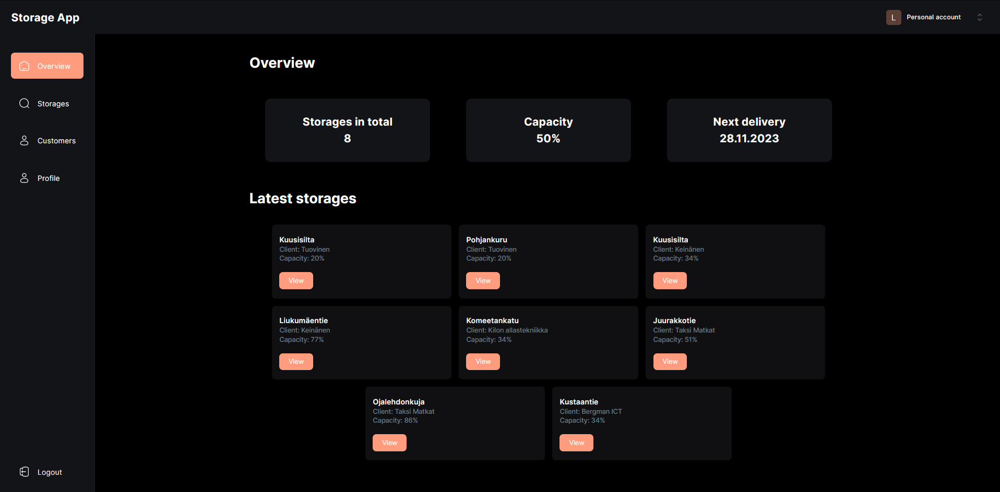
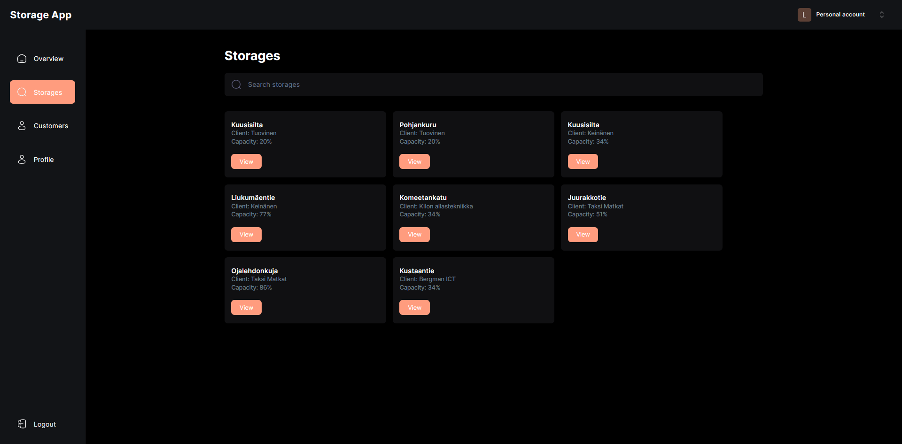
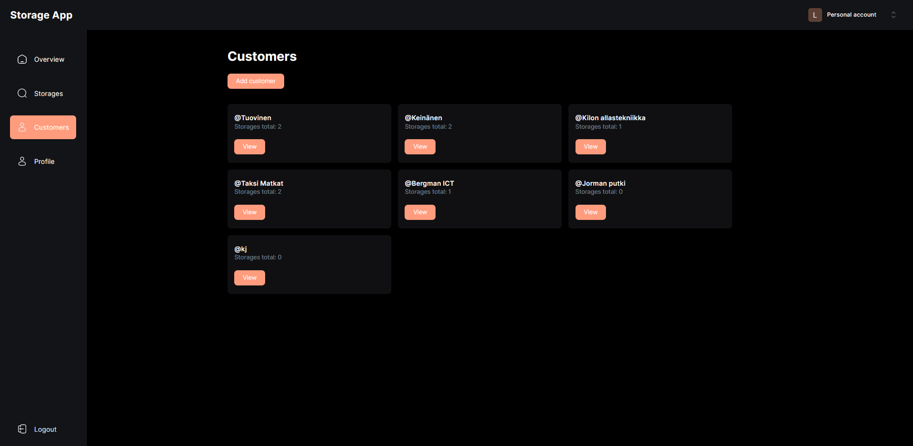
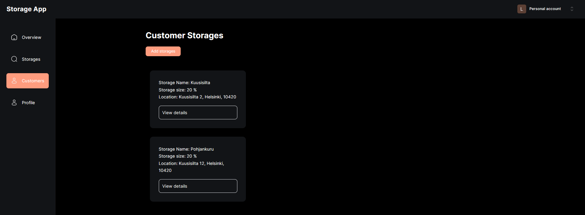

# Storage App
> This is a admin dashboard to manage clients storages

## Table of Contents
* [General Info](#general-information)
* [Technologies Used](#technologies-used)
* [Features](#features)
* [Screenshots](#screenshots)
* [Setup](#setup)
* [Project Status](#project-status)
* [Room for Improvement](#room-for-improvement)
* [Contact](#contact)
<!-- * [License](#license) -->

## General Information
- The purpose of this project was a school project where we were given free hands to come up with a fullstack app
<!-- You don't have to answer all the questions - just the ones relevant to your project. -->

## Technologies Used
- Next.JS - version 13.5.4
- Typescript - version 5.0
- Tailwind CSS - version 3.0
- Clerk - version 4.24.2
- Mongodb - version 6.1

## Features
- Authentication 
- Adding new clients
- Adding new storages for clients
- Delivery history
- Responsive

## Screenshots

<!-- add img folder to root where readme file is located  -->

## Setup
To run this project you need Mongodb and Clerk accounts and setup environments to get secret keys

Cloning the repository `git clone https://github.com/Jebbis/storageapp.git`

Install dependecies `npm i`

Start the app `npm run dev`

## Project Status
Project is:  _complete_

## Room for Improvement

Further development:
- Make the authentication and user management system better
- UI fixes
- Cleaning the code
- New delivery feature

## Contact
[LinkedIn](https://www.linkedin.com/in/lasse-h%C3%A4m%C3%A4l%C3%A4inen-09b869181/)

Discord - lasse0

<!-- Optional -->
<!-- ## License -->
<!-- This project is open source and available under the [... License](). -->

<!-- You don't have to include all sections - just the one's relevant to your project -->
